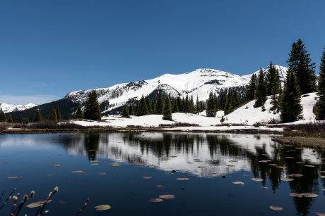
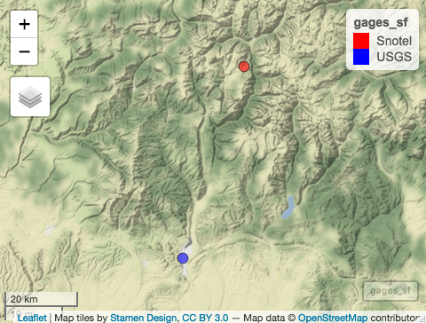
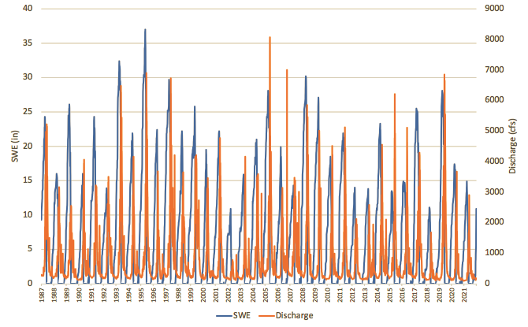

\newpage

```{r setup, include=FALSE}
# Set your working directory

setwd("/Users/Aislinn/Documents/GitHub/WDAFinalProject/")

# Load your packages

library(tidyverse)
library(dataRetrieval)
library(lubridate)
library(cowplot)
library(sf)
library(mapview)
library(Kendall)

# Set your ggplot theme

mytheme <-
  theme_gray(base_size = 12) +
  theme(legend.background = element_rect(fill = "gray"), legend.position = "bottom",
        plot.title = element_text(face = "bold", size = 14, color = "black", hjust = 0.5),
        plot.subtitle = element_text(size = 10, color = "black", hjust = 0.5))

theme_set(mytheme)

# Load your datasets

gages <- read.csv("./data/raw/gages.csv", header = TRUE)

discharge <- readNWISdv(siteNumbers = "09361500", parameterCd = "00060", startDate = "", endDate = "")

snotel <- read.csv("./data/raw/snotel_data.csv")

# Wrangle datasets

Days <- as.data.frame(seq.Date(from=as.Date("1987/01/01"),to=as.Date("2021/12/31"), by ="day"))
colnames(Days) <- "Date"

discharge_wrangled <- discharge %>%
  filter(Date >= "1987-01-01" & Date <= "2021-12-31") %>% 
  rename("Discharge" = "X_00060_00003") %>%
  select(c(Date, Discharge))

discharge_wrangled <- left_join(Days, discharge_wrangled)

write.csv(discharge_wrangled, "./data/processed/discharge_wrangled.csv")

snotel$Date <- mdy(snotel$Date)

snotel_wrangled <- snotel %>%
  filter(Date >= "1987-01-01" & Date <= "2021-12-31") %>%
  mutate(Year = year(Date)) %>%
  select(Date, SWE..in., Year) %>%
  rename("SWE" = "SWE..in.")

snotel_wrangled <- left_join(Days, snotel_wrangled)

write.csv(snotel_wrangled, "./data/processed/snotel_wrangled.csv")

```


# Rationale and Research Questions



While a number of the rivers we've examined over the course of the semester are in North Carolina and have discharge levels driven primarily by precipitation, many rivers in the western U.S. are heavily influenced by runoff from snowpack and their discharges are more seasonal. The relationship between snowpack, measured as snow-water equivalent (SWE), and discharge is less direct than precipitation and discharge, and often influenced by a number of other factors. My project aims to establish a direct relationship between SWE and discharge through two questions:

* What is the relationship between peak SWE and peak discharge in terms of magnitude and timing?

* How has the lag time between peak snowpack and peak runoff changed over time?

\newpage

# Dataset Information & Methodology

Discharge data was obtained from USGS gage 09361500 on the Animas River at Durango, CO. SWE data was obtained from SNOTEL sensor 632 located at Molas Lake, approximately 34 miles upstream of the USGS gage. Figure 2 illustrates the location of both data collection sites. Although the period of record for discharge at this USGS gage extends from October 1, 1897 to present day, this study is limited to the first full calendar year of SNOTEL and USGS data. SNOTEL data collection began at Molas Lake on August 6, 1986. This study examines the period from 1987-2021.



Peak annual discharge is the maximum daily discharge measured in cubic feet per second recorded for each year. Peak annual SWE is the maximum daily SWE measured in inches recorded for each year. To account for multiple peaks within a calendar year, this study uses the maximum discharge or maximum SWE recorded at the latest date in each year.

\newpage

# Exploratory Analysis 

Discharge on the Animas River is very seasonal, typically characterized by peaks in the months of May and June due to runoff from snowmelt (Figure 3). A Mann-Kendall test shows that discharge on the Animas has been decreasing significantly since 1987 (p < 0.05).

```{r, echo = FALSE, message = FALSE, results="hide",fig.keep= "all", fig.cap="Daily discharge measured in cubic feet per second on the Animas River at Durango, Colorado"}

discharge_ts <- ts(discharge_wrangled[[2]], frequency = 1)
discharge_model <- MannKendall(discharge_ts)
summary(discharge_model)

ggplot(data = discharge_wrangled, aes(x = Date, y = Discharge)) +
  geom_line() +
  labs(title = "Daily Discharge on the Animas River", subtitle = "1987-2021", y = "Discharge (cfs)") + 
  geom_smooth(method = lm)


```

\newpage

The seasonality of SWE in the mountains above Durango generally mirrors that of discharge in the Animas River (Figure 4), although peak SWE occurs 54 days prior to peak discharge on average. a Mann-Kendall test reveals that SWE has also been decreasing during the same period. It is unsurprising that both levels of discharge and SWE have decreased from 1987-2021: a new study reveals that "2000-2021 was the driest 22-yr period since at least 800" [@WILLIAMS2022232].

```{r, echo = FALSE, message = FALSE, results="hide",fig.keep= "all", fig.cap="Snow water equivalent at Molas Lake, upstream of the Animas River USGS gage in Durango"}

snowpack_ts <- ts(snotel_wrangled[[2]], frequency = 1)
snowpack_model <- MannKendall(snowpack_ts)
summary(snowpack_model)

ggplot(data = snotel_wrangled, aes(x = Date, y = SWE)) +
  geom_line() +
  labs(title = "Daily SWE at Molas Lake", subtitle = "1987 - 2021", y = "SWE (in)") + 
  geom_smooth(method = lm)


```

\newpage

# Analysis


## Question 1: What is the relationship between peak SWE and peak discharge in terms of magnitude and timing?

In general, peak SWE and peak discharge appear to mirror each other quite closely in magnitude (Figure 5). Years with more snowpack generally also have higher discharges, although the maximum discharges across the period of record are not necessarily correlated with maximum SWE. The highest annual maximum discharges on the Animas from 1987-2021 occurred in 2005 and 2006 while the highest annual maximum SWE occurred in 1995 and 1993. 




```{r echo = FALSE, message = FALSE, results="hide",fig.keep= "all"}

snotel_max <- snotel_wrangled %>%
  group_by(Year) %>%
  mutate(max = max(SWE)) %>%
  filter(max == SWE) %>%
  group_by(Year) %>%
  filter(Date == max(Date)) # chose latest date in year

discharge_max <- discharge_wrangled %>%
  mutate(Year = year(Date)) %>%
  group_by(Year) %>%
  mutate(Max = max(Discharge)) %>%
  filter(Max == Discharge) %>%
  group_by(Year) %>%
  filter(Date == max(Date)) # chose latest date in year

df_max <- merge(discharge_max, snotel_max, by = "Year") %>%
  rename(c("max_discharge_date" = "Date.x", "max_snowpack_date" = "Date.y"), "max_discharge_cfs" = "Max", "max_swe_in" = "max") %>%
  mutate(lag = as.numeric(difftime(max_discharge_date, max_snowpack_date, units = "days")),
         max_discharge_date_daynum = yday(max_discharge_date))

```


A linear model shows that peak SWE explains 43% of the variability in peak discharge (p < 0.001)(Figure 6). Although a linear model does not show a significant relationship, it also appears that peak SWE helps determine the day of the year on which maximum annual discharge occurs: the higher the peak SWE, the more days it takes to reach peak discharge (Figure 7). A denser snowpack will take longer to melt, resulting in a delayed peak discharge on the river.

```{r echo = FALSE, message = FALSE, warning = FALSE, results="hide",fig.keep= "all", fig.cap="The relationship between peak annual SWE and peak annual discharge"}

# does peak SWE help determine peak discharge?

SWE_discharge_model <- lm(data = df_max, max_discharge_cfs ~ max_swe_in)
summary(SWE_discharge_model)

ggplot(df_max, aes(x = max_discharge_cfs, y = max_swe_in)) +
  geom_point() +
  geom_smooth(method = lm, se = FALSE) +
  labs(title = "Peak Discharge and Peak SWE", subtitle = "1987-2021", x = "Maximum Annual Discharge (cfs)", y = "Maximum Annual SWE (in)")
```


``` {r echo = FALSE, message = FALSE, warning = FALSE, results="hide",fig.keep= "all", fig.cap="Relationship between peak SWE and the day of the year on which peak discharge occurs"}
# does peak SWE determine timing of peak discharge?

SWE_discharge_timing_model <- lm(data = filter(df_max, max_discharge_date_daynum < 200), max_discharge_date_daynum ~ max_swe_in)
summary(SWE_discharge_timing_model)

ggplot(filter(df_max, max_discharge_date_daynum < 200), aes(x = max_discharge_date_daynum, y = max_swe_in)) + 
  geom_point() +
  geom_smooth(method = lm, se = FALSE) + 
  labs(title = "Peak SWE and Peak Discharge Timing", subtitle = "1987-2021", x = "Day of Year for Peak Discharge", y = "Peak SWE (in)")

```

\newpage

## Question 2: How has the lag time between peak snowpack and peak runoff changed over time?

Although lag time generally seems to be trending upward, a Mann-Kendall test indicates there is no statistically significant monotonic trend in lag time from 1987-2021 (p > 0.05) (Figure 8). The hypothesis that a greater maximum SWE would lead to a longer lag time was not supported by the analysis which did not reveal any significant relationship between SWE depth and lag time; in fact, lag time appears to decrease as peak SWE increases (Figure 9).

```{r echo = FALSE, message = FALSE, warning = FALSE, results="hide",fig.keep= "all", fig.cap="Days between maximum recorded SWE and maximum recorded discharge for each year from 1987-2021"}

# has lag time been trending up or down?

lag_ts <- ts(df_max[[8]], start = c(1987,1),frequency = 365)

lag_trend <- MannKendall(lag_ts)
summary(lag_trend) # p > 0.05, no monotonic trend

ggplot(df_max, aes(x = Year, y = lag)) +
  geom_line() + 
  geom_smooth(method = lm, se = FALSE) +
  labs(title = "Peak SWE-Peak Discharge Lag Time", subtitle = "1987-2021", y = "Lag Time (# of days)")
```


```{r echo = FALSE, message = FALSE, warning = FALSE, results="hide",fig.keep= "all", fig.cap="Relationship between peak SWE and lag time to peak discharge"}

# does SWE influence lag time?

SWE_lag_model <- lm(data = df_max, max_swe_in ~ lag)
summary(SWE_lag_model)

ggplot(df_max, aes(x = lag, y = max_swe_in)) +
  geom_point() +
  geom_smooth(method = lm, se = FALSE) + 
  labs(title = "Peak SWE and Lag Time", subtitle = "1987-2021", x = "Lag Time (days)", y = "Peak SWE (in)")


```


\newpage

# Summary and Conclusions

Several factors outside the scope of this study have a direct impact on the relationship between SWE and discharge, including soil moisture and water diversions. If the soil moisture is low at the time the ground freezes for the winter, then spring runoff from the snowpack must first rehydrate the soil before flowing down into any other bodies of water. This would explain why greater peak SWE does not necessarily translate into greater peak discharge. Additionally, many water rights allocations exist between the SNOTEL sensor and the USGS stream gage, and many of those are for irrigation (Figure). Water withdrawals from the Animas River upstream of the gage would affect the ability to correlate SWE with discharge.

Although an effort was made to select proximate data sources, the distance between the SNOTEL sensor and the USGS stream gage could influence the relationship between SWE and discharge. It is possible that some of the runoff from snowmelt flowed into a body of water other than the Animas River or evaporated over the course of its path from Molas Lake to the Animas.

Future research could focus on constructing a model that incorporates factors such as soil moisture, precipitation, air temperature, distance from sensor to gage, local water diversions in addition to SWE and discharge data. This model would likely provide a much more comprehensive picture of the relationship between peak SWE and peak discharge and illustrate the impact of more explanatory variables.

\newpage

# References
